# SPEC-1: MediLink - Medical Appointment and Health Record System

## Background

The MediLink project is designed as an 8-day educational workshop where students build an end-to-end medical appointment and health record management application. The focus is on introducing core software engineering principles, Git version control, and full-stack development using MERN for backend and web frontend, and Kotlin Composable for mobile development. The project is designed to parallelize backend, web, and mobile development efforts, simulating a real-world development workflow.

## Requirements

### Must Have (MoSCoW: Must)

- User authentication and role management (Patient, Doctor)
- Booking and managing doctor appointments
- Uploading and scanning medical reports (OCR-based text extraction)
- Web frontend (React, Next) with full feature parity
- Mobile frontend (Kotlin + Jetpack Compose) with full feature parity
- Backend (Node.js, Express.js, MongoDB) with REST API
- Git integration and collaborative workflows
- Software engineering best practices (branching, PRs, commits)

### Should Have

- Appointment history for users
- Profile management for doctors and patients
- Role-based dashboards/UI adjustments
- Basic appointment notifications (status updates in UI)

### Could Have

- Doctor availability management
- Archival view of scanned medical records
- UI indication of appointment status (Confirmed, Cancelled, Pending)

### Won’t Have (in MVP)

- Payments and billing integration
- In-app chat or messaging
- Video consultations
- Advanced analytics or AI integration
- Push notifications

## Method

### Architecture Overview

```plantuml
@startuml
package "MediLink System" {
  [Mobile App (Kotlin)] --> [REST API]
  [Web App (React, Next)] --> [REST API]
  [REST API] --> [MongoDB]
  [REST API] --> [OCR Module]
}
@enduml
````

### User Roles

* **Doctor**: Can manage appointments, view uploaded reports, update status.
* **Patient**: Can book appointments, upload reports, view history.

### Database Schema (MongoDB)

#### Users Collection

* `_id` (ObjectId)
* `name` (String)
* `email` (String, unique)
* `password` (String, hashed)
* `role` (String: 'doctor' | 'patient')
* `profile` (Object)

  * `age`, `gender`, `specialization` (for doctor), etc.

#### Appointments Collection

* `_id` (ObjectId)
* `doctorId` (ObjectId, ref: Users)
* `patientId` (ObjectId, ref: Users)
* `dateTime` (Date)
* `status` (String: 'pending', 'confirmed', 'cancelled')

#### MedicalReports Collection

* `_id` (ObjectId)
* `patientId` (ObjectId, ref: Users)
* `doctorId` (ObjectId, ref: Users)
* `fileUrl` (String)
* `extractedText` (String)
* `uploadedAt` (Date)

### REST API Endpoints

* `POST /auth/signup`
* `POST /auth/login`
* `GET /users/profile`
* `PUT /users/profile`
* `POST /appointments`
* `GET /appointments?role=doctor|patient`
* `PUT /appointments/:id/status`
* `POST /reports/upload`
* `GET /reports/:userId`

### OCR Integration

* Use Tesseract.js or OCR.space API
* Client uploads image/pdf → server parses → returns extracted text

### UI Features for Both Frontends

* Login/Signup, Role-aware dashboards
* Profile management
* Appointment booking/listing
* Medical report upload + OCR preview
* Appointment status tracking

---

## Implementation

### Day-by-Day Implementation Plan

| Day | Goal | Backend Tasks | Web (React, Next) | Mobile (Kotlin) | Tools & Concepts |
|-----|------|---------------|-------------|------------------|------------------|
| **Day 1** | Project Setup | Initialize Express server, MongoDB, environment setup | Create React, Next app, setup routing | Create Android app, setup Jetpack Compose nav | GitHub setup, README, folder structure |
| **Day 2** | Authentication | JWT auth for Doctor/Patient | Auth pages, role-based redirects | Auth screens, role UI logic | JWT, Postman |
| **Day 3** | Profile | Profile CRUD APIs | Profile page, form | Profile screen, update form | Form validation |
| **Day 4** | Appointments | Appointment create/list/status APIs | Appointment form, calendar, list | Date picker, booking UI | API integration |
| **Day 5** | History & Status | History endpoints, status updates | History table/list, status updates | List view, color-coded statuses | Role-aware behavior |
| **Day 6** | OCR Upload | File upload + OCR parse | File picker, upload, preview text | Scan/upload UI, extracted text display | Tesseract/OCR.space |
| **Day 7** | Bug Fixes & Parity | Secure routes, test endpoints | Ensure parity with mobile | Match web behavior & flow | QA testing |
| **Day 8** | Final Review | Final integration & testing | UX polish, demo video | UX polish, demo video | Git cleanup, deployment tips |

### Repository Structure (Monorepo)

```markdown

medilink/
├── backend/
├── web/
├── mobile/
├── README.md
└── .github/

```

### Development Practices

- GitHub branches: `feature/<name>`, `bugfix/<name>`
- Use linting and codeguidelines
- Shared API contract via Swagger/Postman
- Daily demo at EOD

### Testing Guidelines

- Write Unit Testing and End-To-End Testings

---
